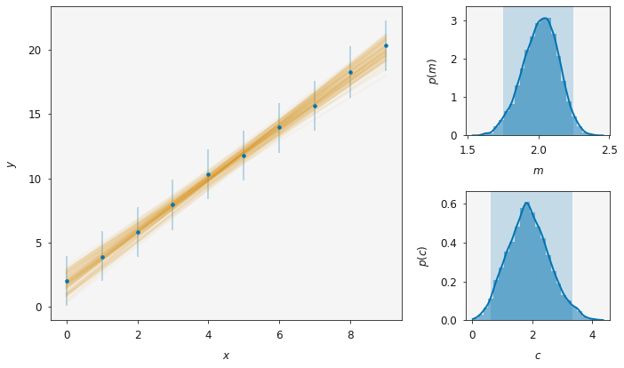

.. uravu documentation master file, created by
   sphinx-quickstart on Fri Feb 21 09:20:56 2020.
   You can adapt this file completely to your liking, but it should at least
   contain the root `toctree` directive.

``uravu`` 
=========

**making Bayesian modelling easy(er)**

``uravu`` is about the relationship between some data and a function that may be used to describe the data. 

The aim of ``uravu`` is to make using the **amazing** Bayesian inference libraries that are available in Python as easy as `scipy.optimize.curve_fit`_.
Therefore enabling many more to make use of these exciting tools and powerful libraries.
Plus, we have some nice plotting functionalities available in the :mod:`plotting` module, capable of generating publication quality figures.

In an effort to make the ``uravu`` API friendly to those new to Bayesian inference, ``uravu`` is *opinionated*, making assumptions about priors amoung other things. 
However, we have endevoured to make it straightforward to ignore these opinions.

In addition to the library and API, we also have some `basic tutorials`_ discussing how Bayesian inference methods can be used in the analysis of data. 

Bayesian inference in Python
----------------------------

There are a couple of fantastic Bayesian inference libraries available in Python that `uravu` makes use of:

- `emcee`_: enables the use of the `Goodman & Weare’s Affine Invariant Markov chain Monte Carlo (MCMC) Ensemble sampler`_ to evaluate the structure of the model parameter posterior distributions,
- `dynesty`_: implements the `nested sampling`_ algorithm for evidence estimation.

To see which publications you should reference in your work, the :class:`Relationship` has a property that will return the relevant citations based on what analyses have been performed.

.. code-block:: python 

   from uravu.Relationship import Relationship
   
   modeller = Relationship(function, abscissa, ordinate, ordinate_error)
   modeller.max_likelihood()
   modeller.mcmc()
   modeller.nested_sampling()
   
   print(modeller.citations)

.. _scipy.optimize.curve_fit: https://docs.scipy.org/doc/scipy/reference/generated/scipy.optimize.curve_fit.html
.. _basic tutorials: ./tutorials.html
.. _emcee: https://emcee.readthedocs.io/
.. _dynesty: https://dynesty.readthedocs.io/
.. _Goodman & Weare’s Affine Invariant Markov chain Monte Carlo (MCMC) Ensemble sampler: https://doi.org/10.2140/camcos.2010.5.65
.. _nested sampling: https://doi.org/10.1063/1.1835238

.. toctree::
   :hidden:
   :maxdepth: 2

   getting_started.ipynb
   tutorials
   api

Searching
=========

* :ref:`genindex`
* :ref:`modindex`
* :ref:`search`
